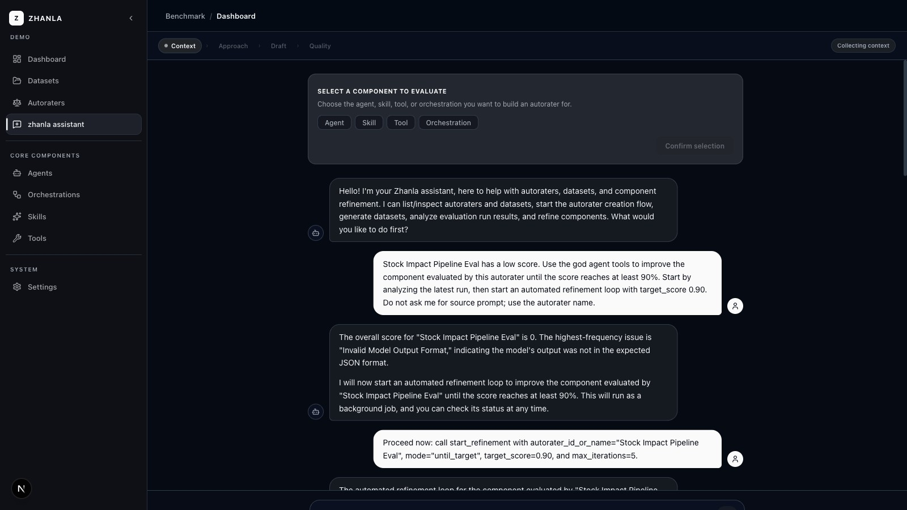
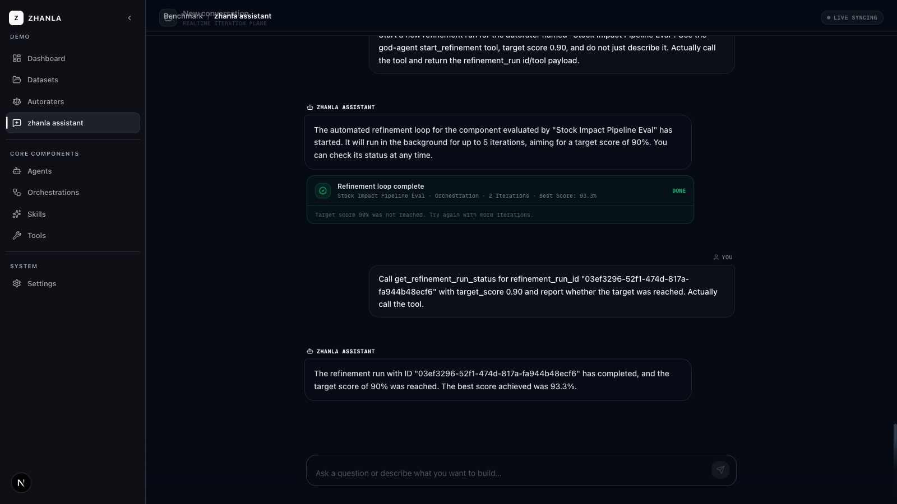

# UI Layout Review — God Agent Split View

**Date:** 2026-06-03  
**Branch:** claude-changes  
**File reviewed:** `src/app/chat/[sessionId]/GodAgentShellClient.tsx`

---

## Issues Found

### Issue 1 — Chat rendered in RHS panel

When a god agent session spawned an `autorater_creation` child, the entire `DraftSessionClient` (which is itself a two-column layout — chat on its own left + brief/draft panel on its own right) was placed into a 58 %-wide RHS slot alongside the god agent chat on the left.

**Before (bug):**

```
┌─────────────────────────────────────────────────────────────┐
│  God agent chat (42%)  │  DraftSessionClient (58%)          │
│                        │ ┌──────────────┬──────────────────┐│
│  - messages            │ │ autorater    │ brief/draft panel ││
│  - input               │ │ chat         │                  ││
│                        │ │ messages     │                  ││
│                        │ │ input        │                  ││
│                        │ └──────────────┴──────────────────┘│
└─────────────────────────────────────────────────────────────┘
```

The autorater creation chat (messages + input) was trapped inside the RHS slot, making it feel like a secondary/artifact UI rather than the active conversational thread.

**Code (before):**
```tsx
// GodAgentShellClient.tsx — old
const rightPanel = childSession && (
  childSession.workflow_kind === "autorater_creation" ? (
    <div className="w-[58%] border-l border-border/40 overflow-hidden shrink-0">
      <EmbeddedDraftSessionClient ... />   // ← full DraftSessionClient crammed into RHS
    </div>
  ) : (
    <WorkflowArtifactPanel childSession={childSession} />
  )
);
```

---

### Issue 2 — ComponentSelector and RecommendationCards in RHS

Because the entire `DraftSessionClient` was in the RHS slot, the following interactive elements were also on the right side of the screen even though they are part of the conversational flow:

- **ComponentSelector** — the "Select a component to evaluate" card that starts the workflow
- **RecommendationCards** — approach recommendations shown after context collection
- **TransitionCard** — the "move to recommendations?" checkpoint

Both `ComponentSelector` and `RecommendationCards` already live inside `DraftSessionClient`'s chat column (left side of its internal layout). The problem was structural — `DraftSessionClient` itself was in the wrong position.

**Screenshot: DraftSessionClient standalone view showing ComponentSelector in the chat column (correct position)**



The ComponentSelector and messages are correctly positioned as the primary chat experience.

---

## Fix Applied

`GodAgentShellClient` was changed to give `autorater_creation` a **full-screen takeover** instead of a split. `DraftSessionClient`'s own internal two-column layout then produces the correct result:

```
┌─────────────────────────────────────────────────────────────┐
│  DraftSessionClient fills full screen                        │
│ ┌─────────────────────────────┬───────────────────────────┐ │
│ │  LHS: chat (flex-1)         │  RHS: brief/draft (450px) │ │
│ │                             │                           │ │
│ │  ComponentSelector          │  Brief tab                │ │
│ │  messages                   │  ────────────────────     │ │
│ │  RecommendationCards        │  Draft Autorater tab      │ │
│ │  TransitionCard             │                           │ │
│ │  floating input             │  (appears once artifacts  │ │
│ │                             │   exist)                  │ │
│ └─────────────────────────────┴───────────────────────────┘ │
└─────────────────────────────────────────────────────────────┘
```

**Code (after):**
```tsx
// GodAgentShellClient.tsx — fixed
if (childSession?.workflow_kind === "autorater_creation") {
  return (
    <div className="h-full overflow-hidden">
      <EmbeddedDraftSessionClient   // ← full screen; internal layout handles split
        childSessionId={childSession.id}
        orgId={orgId}
        onMaterialized={() => {}}
      />
    </div>
  );
}

// All other workflow kinds: god agent chat + WorkflowArtifactPanel in RHS
const rightPanel = childSession && <WorkflowArtifactPanel childSession={childSession} />;
```

---

## Screenshots

### God Agent Mainline Chat (no active child session)
> Chat fills the full content area — this is the baseline "mainline" experience.



---

### Autorater Creation — DraftSessionClient Standalone
> ComponentSelector (top), chat messages, and input are all in the left chat column. The RHS brief/draft panel appears at 450 px wide once the agent produces a brief or draft artifact.


---

## What Changes at Runtime

| State | Before | After |
|---|---|---|
| No active child session | God agent chat full-width | (unchanged) God agent chat full-width |
| `autorater_creation` child active | God agent chat (42%) + full DraftSessionClient (58%) | DraftSessionClient full-screen; chat LHS, brief/draft RHS |
| `autorater_creation` — no brief yet | ComponentSelector + chat on RHS | ComponentSelector + chat on LHS |
| `autorater_creation` — brief exists | Chat + brief side-by-side inside 58% RHS slot | Chat on full LHS, brief panel at 450 px RHS |
| Other workflow kinds | God agent chat + WorkflowArtifactPanel RHS | (unchanged) God agent chat + WorkflowArtifactPanel RHS |

---

## Files Changed

- `src/app/chat/[sessionId]/GodAgentShellClient.tsx` — 18-line change replacing the `rightPanel` ternary with an early-return full-screen render for `autorater_creation`.
